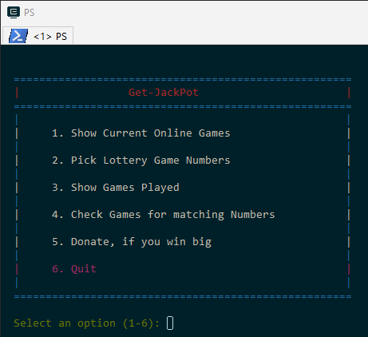
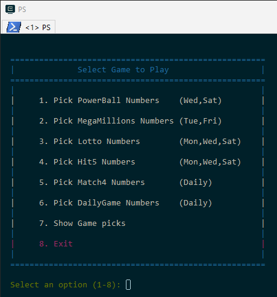
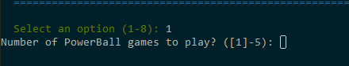
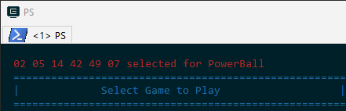

To use the character base menu system rather than using the command line options execute **Get-JackPot** without specifying any command line options.

    PS> Get-JackPot

The main menu will be displayed.

***
The first step is to enter '1' to **Show Current Online Games** and determine which games are being
played today.

***
Next enter '2' to **Pick Lottery Game Numbers**.  The following game menu will be displayed.

Enter the number of the desired game to be played and you will be prompted to enter the number of games you want to play. By default 1 game is always played, so if you just want to select a single set of numbers for a game just press the return key.

When a single set of game numbers are selected, the set of numbers selected will be displayed on the top of the menu.

To display all the games for which number sets have been generated select option **7. Show Game picks**.  The selected set of numbers are contained in the file, **JackPot-Picks.csv**.

***
With these numbers in hand, go to your local lottery store and complete the game card.

By default only the most frequent winning numbers for the game are candidates for selection.  The default selection process can be overridden by specifing the '-all' option.  See the developer notes on how to specify your own set of favorite numbers for each game.

Once the '-all' is specified that method becomes the new default. To switch back to the prior default selection method the file, **JackPot-HotNums.csv** must be deleted.  **This functionality is only support via command line options.**

***
Once the drawing for each game has been completed select option **4. Check Games for matching numbers**

Next the winning results are compared to the picked numbers for the game and a report is generated showing the balls matched per game.

The recent game picks in the file, **JackPot-Picks.csv** are updated with the winning results and the match count is then moved to the file **JackPot-PickHostory.csv**. Afterwards, the **JackPot-Picks.csv** file is removed.

***
If you win big, please consider selecting option **5. Donate**
