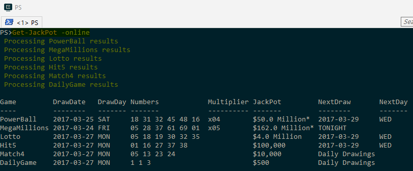
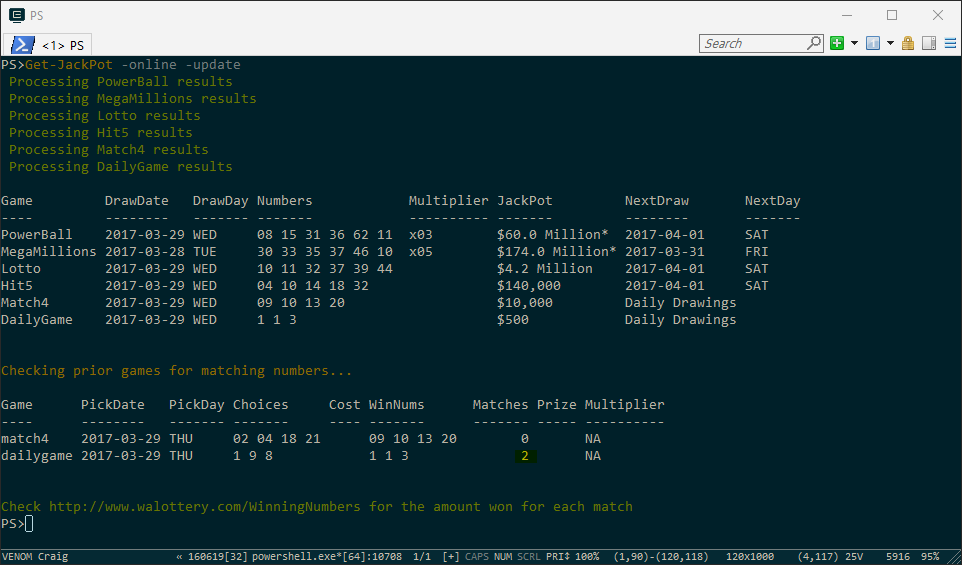

To view the current winning game numbers and verify that everything is setup correctly enter the following command.

    PS> Get-JackPot -online

The output should appear simliar to this.

If errors occurred executing the above command, then resolve the issue before executing any other commands.

The above command invokes a web request to http://www.walottery.com/WinningNumbers and extracts the game data to be displayed on the PowerShell console. No data on your local computer is updated when running this command.
***
The next step is to execute the following command.

    PS> Get-JackPot -update

The output will appear exactly as the prior example, but this time the display data is also retained in a file named, **JackPot-Results.csv** on your local computer in the same folder that Get-JackPot was intalled to.

The command will need to be executed once a day to keep the data current in the **JackPot Game History file**.
***
Now it is game day.  From the prior examples, we know the day that each game is going to be played.

On the day of the game, enter the following command to pick winning numbers for each game to be played.

    PS> Get-JackPot -update -picker -game PowerBall -count 2

Generates 2 sets winning numbers for the 'PowerBall' game and places the bets into the file, **JackPot-Picks.csv**.

    Example Output:
      PowerBall Game (1):  16 23 25 32 64 09
      PowerBall Game (2):  25 28 40 52 64 21

With these numbers in hand, go to your local lottery store and complete the game card.

By default only the most frequent winning numbers for the game are candidates for selection.  The default selection process
can be overridden by specifing the '-all' option.  See the Version History notes on how to specify your own set of favorite numbers for each game.

Once the '-all' is specified that method becomes the new default. To switch back to the prior default selection method the file, **JackPot-HotNums.csv** must be deleted.
***
Once the drawing for each game has been completed.

If the **Get-JackPot** script was used to generate each game's winning numbers, then execute the following command to determine if you have won any money.

    PS> Get-JackPot -online -update

Queries the lottery web page and then extracts and displays the current game results.
    
Next the winning results are compared to the picked numbers for the game and a report is generated showing the balls matched per game.

The recent game picks in the file, **JackPot-Picks.csv** are updated with the winning results and the match count is then moved to the file **JackPot-PickHostory.csv**. Afterwards, the **JackPot-Picks.csv** file is removed.

With the output displayed from the command **'Get-JackPot -online -update'**, we see that the 'DailyGame' is the only potential winning ticket.
