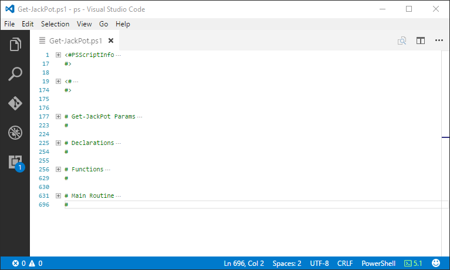
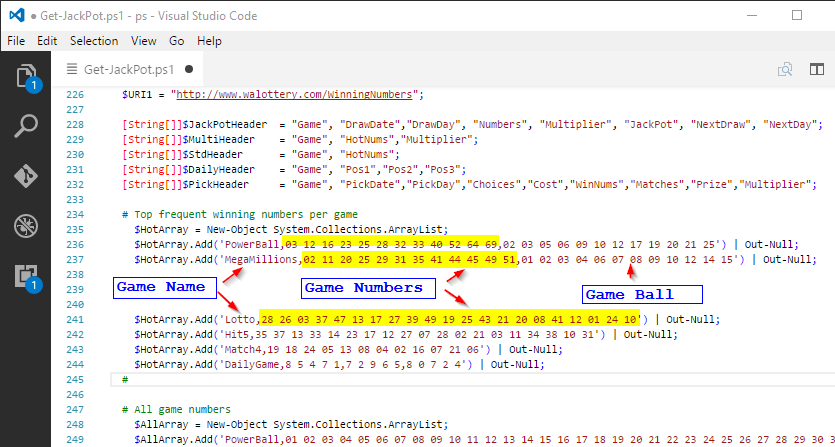
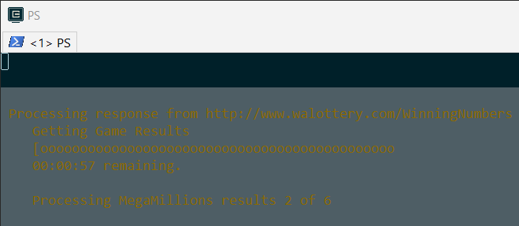

Date | Version | Description
---- | ------- | -----------
10/21/2017 | 3.2.0 | On 10/28/2017, MegaMillion game ranges will be (1-70) & MegaBall is (1-25)
06/18/2017 | 3.1.0 | [Improved Progress Bar by Staffan Gustafsson](#improved-progress-bar-by-staffan-gustafsson)
04/05/2017 | 3.0.0 | Implemented Menu system to simplify the game play.
04/01/2017 | 2.1.1 | Fix logic error with selection of game numbers.
03/27/2017 | 2.1.0 | Added feature to evaluate picked numbers against winning numbers.
03/24/2017 | 2.0.0 | Added feature to generate a set of winning numbers.
***

# Code Structure

The code structure of the **Get-JackPot** script (spacing, indentation and etc... ) is influenced on how Visual Studio Code does code folding.  The code folding feature in vscode is something I try to leverage has much as possible.  When opening the script in vscode, my first command is always 'Ctrl+K+0'. This will colapse the 700 hundred lines of code so it can be displayed on a single page.

***

# Modifying the game selection numbers

The selection of game numbers is randomly chosen based on a set of numbers defined in an array collections of objects containing 2 or 3 fields separated by a comma depending on the game.

The $HotArray definition as shown above consists of a set of numbers that are most frequently choosen for each game.  The first field is always the name of the game and the second field is always a pool of numbers. Numbers selected for each game played are randomly selected from the game's pool of numbers.

PowerBall and MegaMillion are unique in that they have a second pool of numbers upon which a random selection of a single number is performed.  I call this the game ball, but offically they are named the PowerBall and the MegaBall.

If desired, the set of numbers in the pool can be anything you desire.  I just happened to use numbers that are most frequently drawn for each game.

By default, the $HotArray is always used as the pool of numbers to be used for number selection. The array $HotArray is written to a file called, **JackPot-HotNums.csv** in the execution folder.  If the file doesn't exist in the execution folder it will be created automatically.

When the CLI is used to pick numbers and the '-all' option is specified, the array called $AllArray is written to a file called, **JackPot-HotNums.csv** found in the execution folder. The file will now contain all of the available numbers for each game.

The file, **JackPot-HotNums.csv** is always loaded at the beginning to determine the set of numbers available for each game. If desired, this file can be modified with any ASCII editor to set the selection of game numbers to your own desired values.

# Improved Progress Bar by Staffan Gustafsson

At the PowerShell Conference EU in 2017, **Staffon Gustafsson** did an excellent presentation called, [Professional cmdlets and module design](https://www.youtube.com/watch?v=dCynoJWFnN8&list=PLDCEho7foSooHYGxYqUj2Q6C7usp4aKIQ&index=60).

His **ProgressManager** class has been incorporated into **Get-JackPot**.

After selecting option 1 or 4 from the main menu, the following progress bar will be displayed.

You'll notice it displays the game currently being processed along with the estimated completion time and number of games
remaining to be processed.
